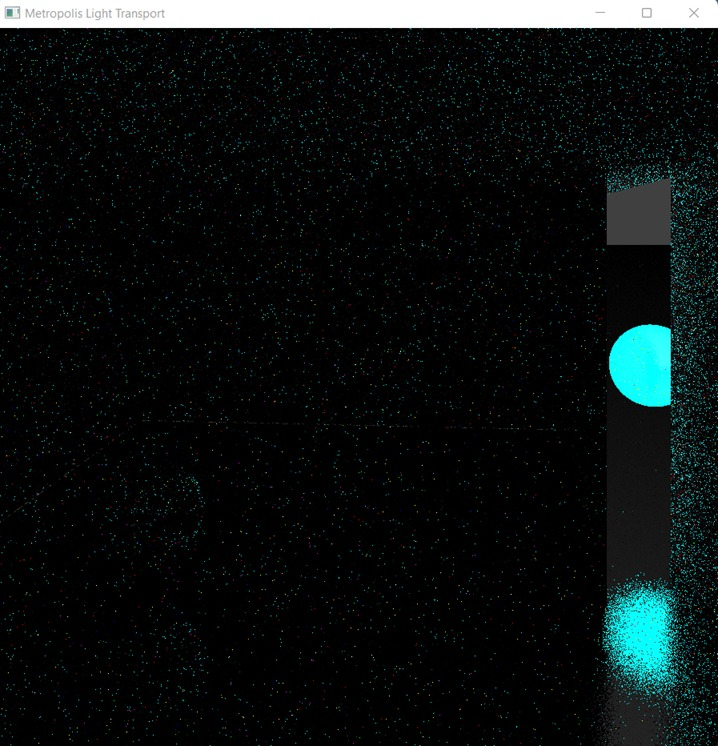

## Markov Chain
This is a stochastic model comprising of objects usually defined as a family of random variables, describing a sequence of possible events in which probability of next event depends solely on that of the current state. To avoid any process termination, it is assumed that all possible states and the nodes in transition matrix are included in definition of the process itself.
Markovian processes are the basis for simulation methods called *Markov Chain Monte Carlo*

## Markov Chain Monte Carlo - MCMC
These methods cover a class of algorithms for sampling from a probability distribution. A markov chain (which has the desired distribution as its equilibrium distribution) is constructed and states from the chain are recorded to get a sample of the desired distribution. The model can be improved by increasing the number of steps involved.

# Metropolis-Hastings algorithm
This is an MCMC method to get a sequence of random samples from a desired probability distribution, particularily useful when direct sampling is difficult. The algorithm finds its uses in approximating distitbutions and evaluating statistical integrals.
The algorithm can draw samples from a distribution with probability density $P(x)$ , given a function $f(x)$ which is *proportional* to our density $P$. It iteratively generates a sequence of samples such that with production of more samples, the distribution matches closer to the actual desired one. 
At each iteration, a candidate is picked for the next random value based on current state. This is either accepted or rejected with some probability threshold, with the current value being passed on for later iterations in latter case.  

Here is an image using the MLT algorithm we have implemented (10 mutations per pixel):  

