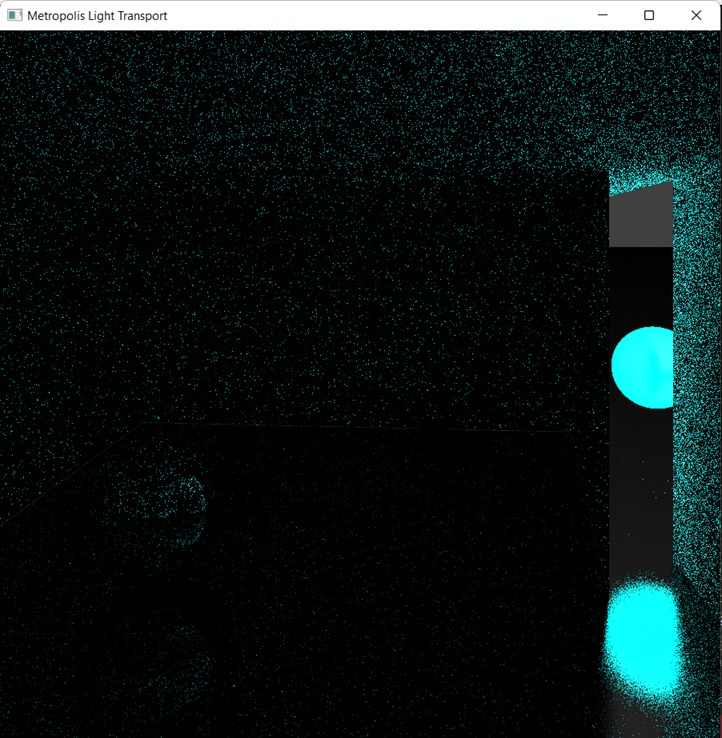

## Monte Carlo methods
These are a set of computational algorithms relying on random sampling to get numerical results. The Monte Carlo methods find their use primarily in problems inolving probabilistic interpretation. The underlying concept is to use randomness to solve problems that might be deterministic in principle. Monte Carlo methods are mainly used in three problem classes: optimization, numerical integration, and generating draws from a probability distribution.

# Path Tracing
Path tracing was the first general-purpose unbiased Monte Carlo light transport algorithm used in graphics. It was introduced as an algorithm to find a numerical solution to the integral of the rendering equation (which is based on the law of conservation of energy) - solving the rendering equation for any given scene is the primary challenge in realistic rendering.  
Path tracing incrementally generates paths of scattering events starting at the camera and ending at light sources in the scene. Repeated sampling of any given pixel eventually causes the average of the samples to converge on the correct solution of the rendering equation.  
  
Here is an image using the path tracing we have implemented (10 samples per pixel):

